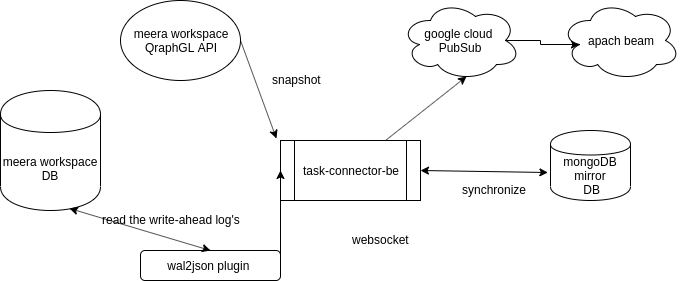

# Task connector be
task-connector-be is microservice that tracks the meera workspace data and the life cycle of all tasks on a worksapce.

> task-connector use logical decoding to detect change in meera workspace database.

* Logical Decoding


Logical decoding is the process of extracting all persistent changes to a database's tables into a coherent, easy to understand format 
which can be interpreted without detailed knowledge of the database's internal state.

In PostgreSQL, logical decoding is implemented by decoding the contents of the write-ahead log, which describe changes on a storage 
level, into an application-specific form such as a stream of tuples or SQL statements.

In the context of logical replication, a slot represents a stream of changes that can be replayed to a client in the order 
they were made on the origin server. Each slot streams a sequence of changes from a single database.


* Replication Slots

A replication slot has an identifier that is unique across all databases in a PostgreSQL cluster. Slots persist 
independently of the connection using them and are crash-safe.

A logical slot will emit each change just once in normal operation. 

The current position of each slot is persisted only at checkpoint, so in the case of a crash the slot may return to an earlier LSN (Log Sequence Number), 
which will then cause recent changes to be resent when the server restarts. 

Logical decoding clients are responsible for avoiding ill effects from handling the same message more than once. Clients may wish to record the last LSN they saw when decoding and skip over any repeated data or (when using the replication protocol) request that decoding start from that LSN rather than letting the server determine the start point. The Replication Progress Tracking feature is designed for this purpose, refer to replication origins.

Multiple independent slots may exist for a single database. Each slot has its own state, allowing different consumers to receive changes from different points in the database change stream. For most applications, a separate slot will be required for each consumer.

A logical replication slot knows nothing about the state of the receiver(s). It's even possible to have multiple different receivers using the same slot at different times; they'll just get the changes following on from when the last receiver stopped consuming them. Only one receiver may consume changes from a slot at any given time


* Output Plugins

Output plugins transform the data from the write-ahead log's internal representation into the format the consumer of a replication slot desires.

In our case wi are using  wal2json  https://github.com/eulerto/wal2json.


## PostgreSQL Server Configuration
Once the wal2json plug-in has been installed, the database server should be configured.

Setting up libraries, WAL and replication parameters
Add the following lines at the end of the postgresql.conf PostgreSQL configuration file in order to include the plug-in at the shared libraries and to adjust some WAL and streaming replication settings. The configuration is extracted from postgresql.conf.sample. You may need to modify it, if for example you have additionally installed shared_preload_libraries.

postgresql.conf , configuration file parameters settings

############ REPLICATION ##############
# MODULES
shared_preload_libraries = 'wal2json'   

# REPLICATION
wal_level = logical                     
max_wal_senders = 10                     
max_replication_slots = 10    


1. tells the server that it should load at startup the wal2json (use decoderbufs for protobuf) logical decoding plug-in(s) (the names of the plug-ins are set in protobuf and wal2json Makefiles)
2. tells the server that it should use logical decoding with the write-ahead log
3. tells the server that it should use a maximum of 4 separate processes for processing WAL changes
4. tells the server that it should allow a maximum of 4 replication slots to be created for streaming WAL changes

> sudo systemctl restart postgresql 


## Get started 

task-connector has 4 commands:

```
Top level command for utilities and services of the task-connector-be app

Usage:
  tag-connector [command]

Available Commands:
  extract-tasks Start extract tasks service
  help          Help about any command
  start-job     Start A job runner for executing scheduled
  version       Print the version and exit

Flags:
  -h, --help   help for tag-connector

Use "tag-connector [command] --help" for more information about a command.

```

* extract-tasks:

this command creat http server that use logical decoding to stream data change from meera workspace database.

```
Start extract tasks service

Usage:
  tag-connector extract-tasks [flags]

Flags:
      --client-id string         auth2 client id (default "nz-mdr")
      --client-secret string     auth2 client secret (default "DzXZxyDObSpsnR7qLqQ4p1LEVoIiE49e")
      --db string                Name of the database to connect to
  -h, --help                     help for extract-tasks
      --mongo-addr string        mongo hostname (default "mongodb://localhost:27017")
      --oidc string              oidc provider hostname (default "https://sso.test.meeraspace.com/token")
      --password string          Postgres password (default "postgres")
      --pgHost string            Postgres server hostname (default "localhost")
      --pgPort int               Postgres server port (default 5432)
      --project-id string        Sets your Google Cloud Platform project ID. (default "target-datalake-ng")
      --serverHost string        Host to listen on (default "0.0.0.0")
      --serverPort string        Port to listen on (default "8080")
      --service-account string   Path to Service Account .json file (default "./service-account-file.json")
      --topic string             The PubSub topic to use (default "taskTopic")
      --user string              Postgres user name (default "postgres")
      --ws string                workspace provider hostname (default "https://test.meeraspace.com/graphql")

```

- API

```
 GET    /info                     --> gitlab.com/target-smart-data-ai-searsh/task-connector-be/extractor.NewExtractor.func2 (4 handlers)
 GET    /v1/api/ws/Stream         --> gitlab.com/target-smart-data-ai-searsh/task-connector-be/extractor.(*Server).StreamChanges-fm (4 handlers)
 GET    /v1/api/ws/Snapshot       --> gitlab.com/target-smart-data-ai-searsh/task-connector-be/extractor.(*Server).Snapshot-fm (4 handlers)
```



* start-job

this command create jub runner that take spnashot of meera workspace every 30min for Qraphql APi and finaly it send it to pubsub.

```
Start A job runner for executing scheduled

Usage:
  tag-connector start-job [flags]

Flags:
      --client-id string         auth2 client id (default "nz-mdr")
      --client-secret string     auth2 client secret (default "DzXZxyDObSpsnR7qLqQ4p1LEVoIiE49e")
  -h, --help                     help for start-job
      --mongo-addr string        mongo hostname (default "mongodb://localhost:27017")
      --oidc string              oidc provider hostname (default "https://sso.test.meeraspace.com/token")
      --project-id string        Sets your Google Cloud Platform project ID. (default "target-datalake-ng")
      --service-account string   Path to Service Account .json file (default "./service-account-file.json")
      --topic string             The Kafka topic to use (default "taskTopic")
      --ws string                workspace provider hostname (default "https://test.meeraspace.com/graphql")

```


